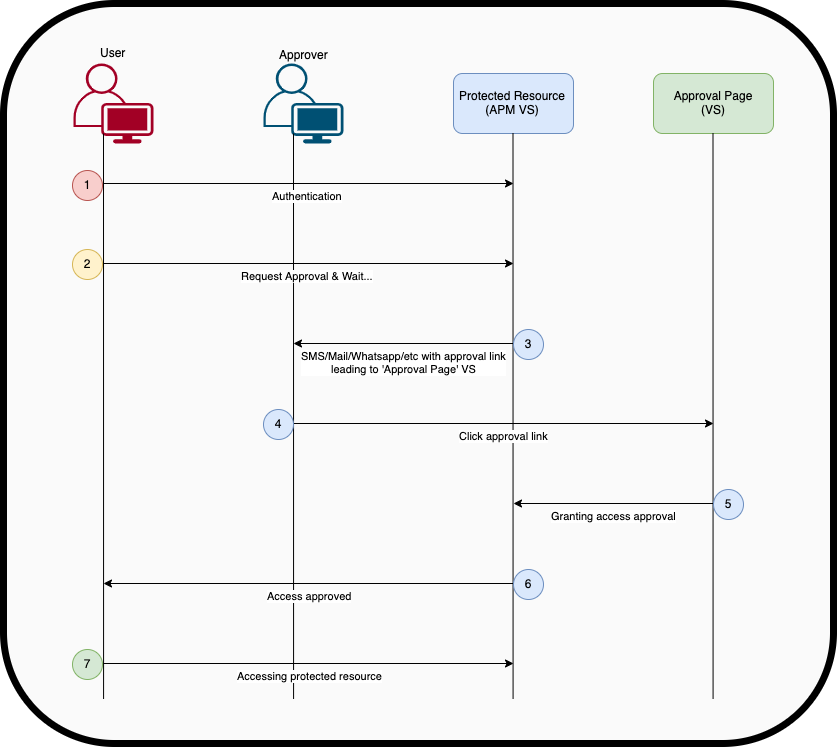
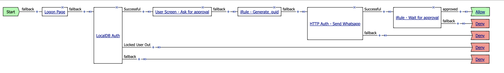

####  F5 APM login with Login-Approver ####
use case 
1. External user login via the F5, the F5 pull the approver number and send SMS .
2. The approver got a link to a page to approve the external user 
3. The approver click Approve for allowing the VPN/Portal access 

Note: this is done by local user DB , can be adjust to AD or other remote authentication source.

VPE Flow : 

1. The user lan on the login page
2. The user authenticate to local DB ( can be remote server)
3. Once Successful login -> the user wait for approval 
  3.1 while the user wait for approval - the F5 
